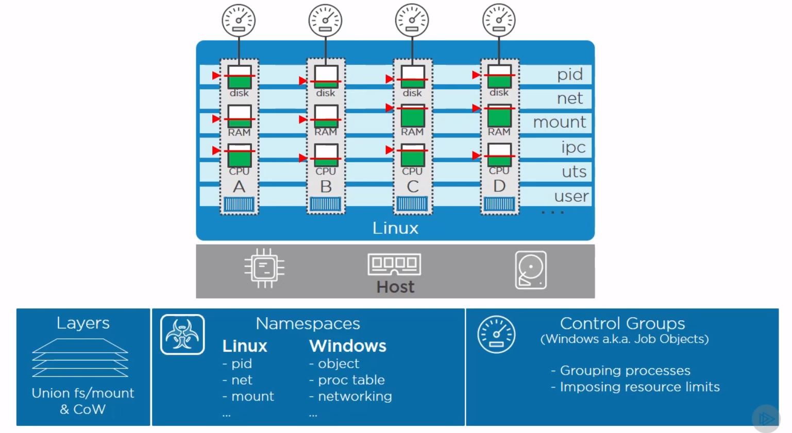
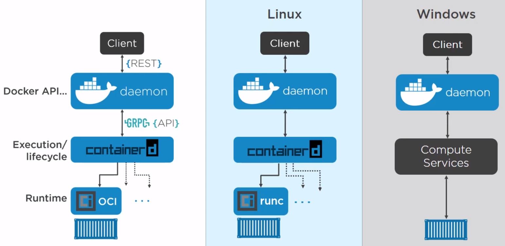
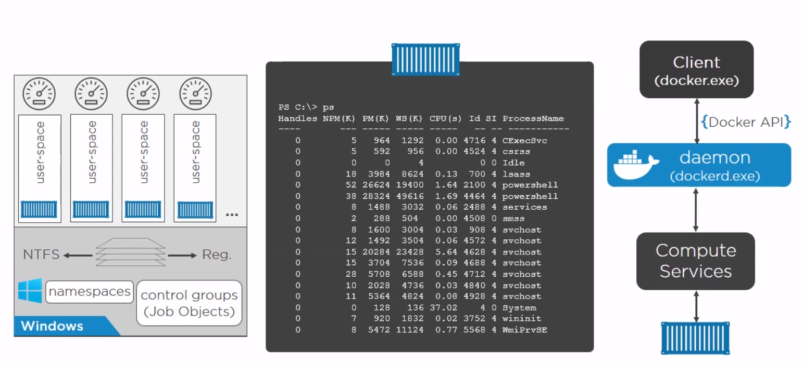
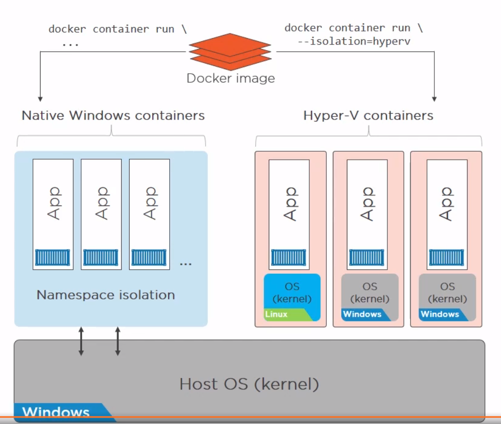

# Architecture Big Picture

**Container** - isolated are of an OS with resources usage limits applied

___

## Kernel internals

### Namespaces

**Linux namespaces:**
- Process ID (pid)
- Network (net)
- Filesystem/mount (mnt)
- Inter-proc comms (ipc)
- UTS (uts) # hostname
- User (user)

Container - has its own group of namespaces (its secure)

### Control groups

- Grouping processes
- Imposing resource limits

## The Docker Engine

## Windows Containers

