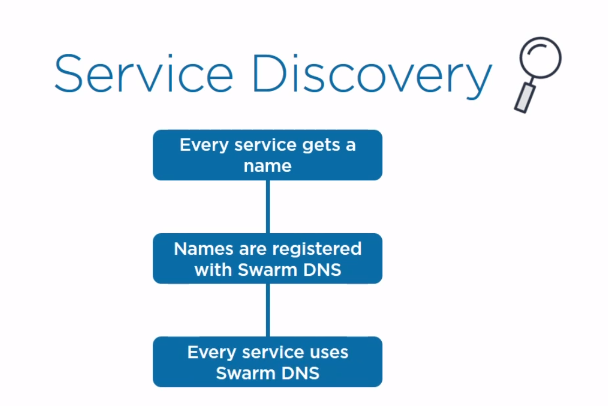
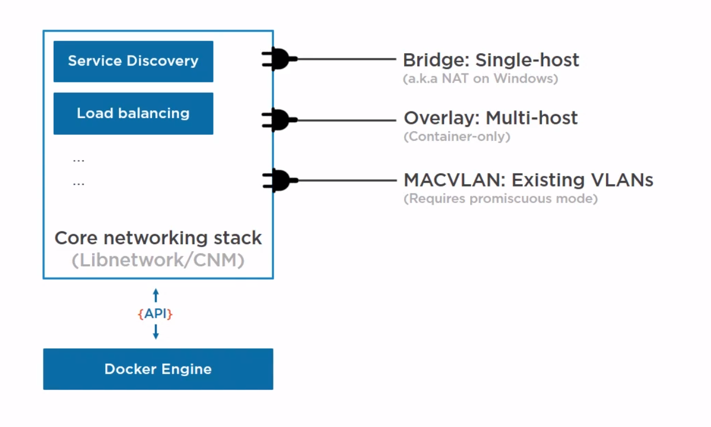

# Container Networking

## Network types in Docker

- Bridge Networking
- Overlay Networking (`docker network create`)
- MACVLAN ()

`docker network inspect`
`docker port <name>`
______

## Network services

______

## Recap

